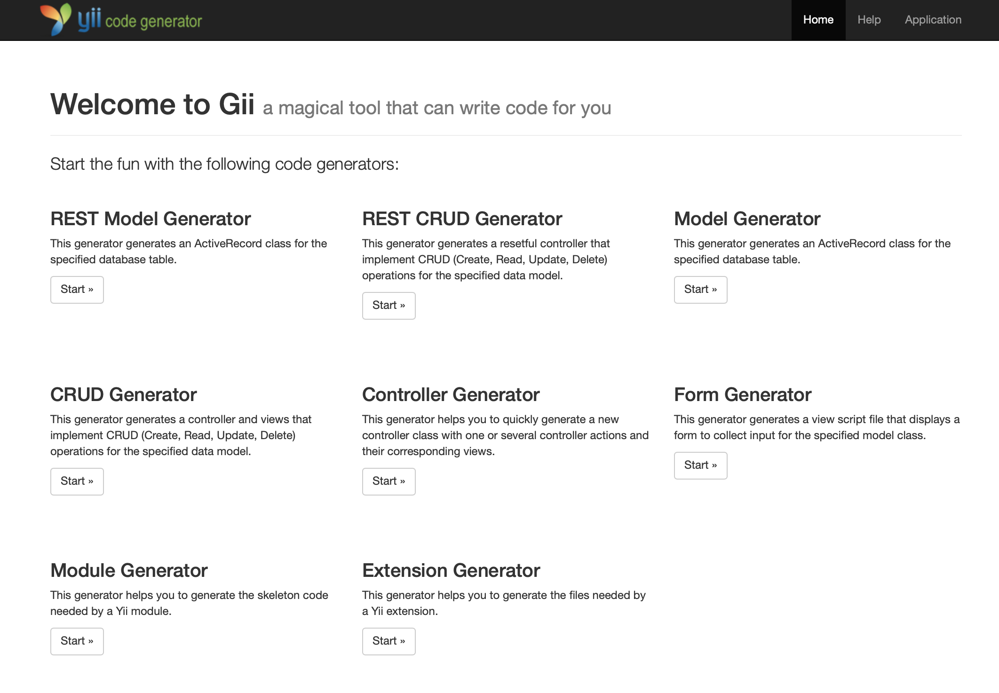

Yii2 RESTful generator for gii
======================
Gii 模块的REST代码生成器，包含Model和Controller。

代码注释文档包含OpenAPI  Specification 规范的文档。 

可配合 [Yii2 OpenApi Reader](https://github.com/bestyii/yii2-openapi-reader) 模块渲染出漂亮的api文档。

安装 Installation
------------

通过 [composer](http://getcomposer.org/download/)安装.

项目中直接运行

```
php composer.phar require --prefer-dist bestyii/yii2-gii-rest "*"
```

or add

```
"bestyii/yii2-gii-rest": "*"
```

或者添加下面代码到 `composer.json`文件


使用 Usage
-----

在`config/web.php` 配置文件中，`gii`的配置部分增加模版：

```php
$config['modules']['gii'] = [
        'class' => 'yii\gii\Module',

        'generators' => [ //自定义生成器
            'rest-model' => [ // generator name
                'class' => 'bestyii\giiRest\generators\model\Generator', // generator class
            ],
            'rest-crud' => [ // generator name
                'class' => 'bestyii\giiRest\generators\crud\Generator', // generator class
            ]
        ],
    ];
```
运行gii，可以看到增加了`REST Model Generator`和`REST CRUD Generator`两个生成器。



生成的代码示例：

示例 controller
```php
<?php

namespace app\modules\api\controllers;

use app\modules\api\models\UserIdentity;
use Yii;
use app\modules\api\models\User;
use yii\data\ActiveDataProvider;
use app\modules\api\components\ActiveController;
use yii\web\NotFoundHttpException;
use yii\web\ServerErrorHttpException;

/**
 * @OA\Tag(
 *   name="Users",
 *   description="用户账号",
 *   @OA\ExternalDocumentation(
 *     description="更多相关",
 *     url="http://bestyii.com"
 *   )
 * )
 */
class UserController extends ActiveController
{
    public $modelClass = 'app\modules\api\models\UserIdentity';

    /**
     * @OA\Get(
     *     path="/users",
     *     summary="查询 User",
     *     tags={"Users"},
     *     description="",
     *     operationId="findUser",
     *     @OA\Parameter(
     *         name="ids",
     *         in="query",
     *         description="逗号隔开的 id",
     *         required=false,
     *         @OA\Schema(
     *           type="integer",
     *           @OA\Items(type="int20"),
     *         ),
     *     ),
     *     @OA\Response(
     *         response=200,
     *         description="查询成功",
     *         @OA\Schema(
     *             type="array",
     *             @OA\Items(ref="#/components/schemas/User")
     *         ),
     *     ),
     *     @OA\Response(
     *         response="400",
     *         description="无效的id",
     *     ),
     *   security={{
     *     "bearerAuth":{}
     *   }}
     * )
     */
    public function actionIndex()
    {
        $dataProvider = new ActiveDataProvider([
            'query' => UserIdentity::find(),
        ]);
        return $dataProvider;
    }

    /**
     * @OA\Get(
     *     path="/users/{id}",
     *     summary="通过ID显示详情",
     *     description="",
     *     operationId="getUserById",
     *     tags={"Users"},
     *     @OA\Parameter(
     *         description="id",
     *         in="path",
     *         name="id",
     *         required=true,
     *         @OA\Schema(
     *           type="integer",
     *           format="int64"
     *         )
     *     ),
     *     @OA\Response(
     *         response=200,
     *         description="操作成功",
     *         @OA\JsonContent(ref="#/components/schemas/User")
     *     ),
     *     @OA\Response(
     *         response="400",
     *         description="无效的ID"
     *     ),
     *     @OA\Response(
     *         response="404",
     *         description="没有找到相应资源"
     *     ),
     *   security={{
     *     "bearerAuth":{}
     *   }}
     * )
     */
    public function actionView($id)
    {
        return $this->findModel($id);
    }

    /**
     * @OA\Post(
     *     path="/users",
     *     tags={"Users"},
     *     operationId="addUser",
     *     summary="添加",
     *     description="",
     *   @OA\RequestBody(
     *       required=true,
     *       description="创建 User 对象",
     *       @OA\JsonContent(ref="#/components/schemas/User"),
     *       @OA\MediaType(
     *           mediaType="application/x-www-form-urlencoded",
     *           @OA\Schema(
     *               type="object",
     *               ref="#/components/schemas/User"
     *          ),
     *       )
     *   ),
     *     @OA\Response(
     *         response=201,
     *         description="操作成功",
     *         @OA\JsonContent(ref="#/components/schemas/User")
     *     ),
     *     @OA\Response(
     *         response=405,
     *         description="无效的输入",
     *     ),
     *   security={{
     *     "bearerAuth":{}
     *   }}
     * )
     */
    public function actionCreate()
    {
        $model = new UserIdentity();
        if ($model->load(Yii::$app->getRequest()->getBodyParams(), '') && $model->save()) {
            $response = Yii::$app->getResponse();
            $response->setStatusCode(201);
        } elseif (!$model->hasErrors()) {
            throw new ServerErrorHttpException('Failed to create the object for unknown reason.');
        }
        return $model;
    }

    /**
     * @OA\Put(
     *     path="/users/{id}",
     *     tags={"Users"},
     *     operationId="updateUserById",
     *     summary="更新指定ID数据",
     *     description="",
     *     @OA\Parameter(
     *         description="id",
     *         in="path",
     *         name="id",
     *         required=true,
     *         @OA\Schema(
     *           type="integer",
     *           format="int64"
     *         )
     *     ),
     *   @OA\RequestBody(
     *       required=true,
     *       description="更新 User 对象",
     *       @OA\JsonContent(ref="#/components/schemas/User"),
     *       @OA\MediaType(
     *           mediaType="multipart/form-data",
     *           @OA\Schema(ref="#/components/schemas/User")
     *       )
     *   ),
     *     @OA\Response(
     *         response=200,
     *         description="操作成功",
     *         @OA\JsonContent(ref="#/components/schemas/User")
     *     ),
     *     @OA\Response(
     *         response=400,
     *         description="无效的ID",
     *     ),
     *     @OA\Response(
     *         response=404,
     *         description="没有找到相应资源",
     *     ),
     *     @OA\Response(
     *         response=405,
     *         description="数据验证异常",
     *     ),
     *   security={{
     *     "bearerAuth":{}
     *   }}
     * )
     */
    public function actionUpdate($id)
    {
        $model = $this->findModel($id);
        if ($model->load(Yii::$app->request->getBodyParams(), '') && $model->save()) {
            Yii::$app->response->setStatusCode(200);
        } elseif (!$model->hasErrors()) {
            throw new ServerErrorHttpException('Failed to update the object for unknown reason.');
        }
        return $model;
    }

    /**
     * @OA\Delete(
     *     path="/users/{id}",
     *     summary="删除User",
     *     description="",
     *     operationId="deleteUser",
     *     tags={"Users"},
     *     @OA\Parameter(
     *         description="需要删除数据的ID",
     *         in="path",
     *         name="id",
     *         required=true,
     *         @OA\Schema(
     *             type="integer",
     *             format="int64"
     *         )
     *     ),
     *     @OA\Response(
     *         response=204,
     *         description="没有找到相应资源"
     *     ),
     *     @OA\Response(
     *         response=400,
     *         description="无效的ID"
     *     ),
     *     @OA\Response(
     *         response=404,
     *         description="没有找到相应资源"
     *     ),
     *   security={{
     *     "bearerAuth":{}
     *   }}
     * )
     */
    public function actionDelete($id)
    {
        $model = $this->findModel($id);
        if ($model->softDelete() === false) {
            throw new ServerErrorHttpException('Failed to delete the object for unknown reason.');
        }
        Yii::$app->getResponse()->setStatusCode(204);
    }

    /**
     * Finds the User model based on its primary key value.
     * If the model is not found, a 404 HTTP exception will be thrown.
     * @param string $id
     * @return User the loaded model
     * @throws NotFoundHttpException if the model cannot be found
     */
    protected function findModel($id)
    {
        if (($model = UserIdentity::findOne($id)) !== null) {
            return $model;
        }
        throw new NotFoundHttpException('The requested User does not exist.');
    }
}

```

示例 model
```php

/**
 * @OA\Schema(
 *      schema="User",
 *      required={"username"},
 *     @OA\Property(
 *        property="id",
 *        description="User ID",
 *        type="integer",
 *        format="int64",
 *    ),
 *     @OA\Property(
 *        property="username",
 *        description="用户名",
 *        type="string",
 *        maxLength=100,
 *    ),
 *     @OA\Property(
 *        property="email",
 *        description="邮箱",
 *        type="string",
 *        maxLength=100,
 *    ),
 *     @OA\Property(
 *        property="password",
 *        description="密码",
 *        type="string",
 *        maxLength=64,
 *    ),
 *     @OA\Property(
 *        property="created_at",
 *        description="创建时间",
 *        type="string",
 *        default="0",
 *    ),
 *     @OA\Property(
 *        property="updated_at",
 *        description="更新时间",
 *        type="string",
 *        default="0",
 *    ),
 *     @OA\Property(
 *        property="last_login_at",
 *        description="最后登录时间",
 *        type="string",
 *        default="0",
 *    ),
 *     @OA\Property(
 *        property="ip",
 *        description="登录IP ip2long",
 *        type="integer",
 *        format="int64",
 *        default=0,
 *    ),
 *)
 */
```
